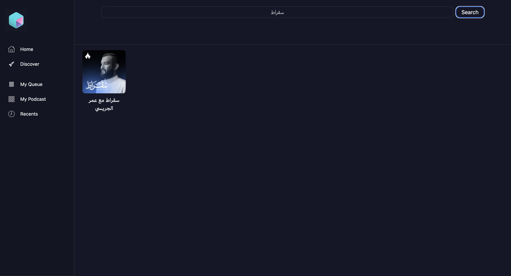

# iTunes Search Application

This project is a web application built with Next.js that allows users to search for music, podcasts, and other media using the iTunes API. The application provides a user-friendly interface to explore various collections and navigate directly to their respective iTunes pages.

## Features
- Search for media by keywords.
- Fetch data from the iTunes API for music and podcasts.
- Display album artwork, collection names, and links to iTunes.
- Responsive design for a seamless experience on all devices.

## Screenshots

### 1. Home Page


### 2. Search Results


## Technologies Used
- **Frontend:** Next.js, React
- **Backend Integration:** iTunes API
- **Styling:** Tailwind CSS
## Deployment

This project has been successfully deployed to **Vercel**, making it accessible online with optimal performance and scalability. You can view the live version of the project at:

[Live Application on Vercel](https://itunes-app-smoky.vercel.app/)
## Getting Started

First, run the development server:

```bash
npm run dev
# or
yarn dev
# or
pnpm dev
# or
bun dev
```

Open [http://localhost:3000](http://localhost:3000) with your browser to see the result.

You can start editing the page by modifying `app/page.js`. The page auto-updates as you edit the file.

This project uses [`next/font`](https://nextjs.org/docs/basic-features/font-optimization) to automatically optimize and load Inter, a custom Google Font.

## Learn More

To learn more about Next.js, take a look at the following resources:

- [Next.js Documentation](https://nextjs.org/docs) - learn about Next.js features and API.
- [Learn Next.js](https://nextjs.org/learn) - an interactive Next.js tutorial.

You can check out [the Next.js GitHub repository](https://github.com/vercel/next.js/) - your feedback and contributions are welcome!

## Deploy on Vercel

The easiest way to deploy your Next.js app is to use the [Vercel Platform](https://vercel.com/new?utm_medium=default-template&filter=next.js&utm_source=create-next-app&utm_campaign=create-next-app-readme) from the creators of Next.js.

Check out our [Next.js deployment documentation](https://nextjs.org/docs/deployment) for more details.
